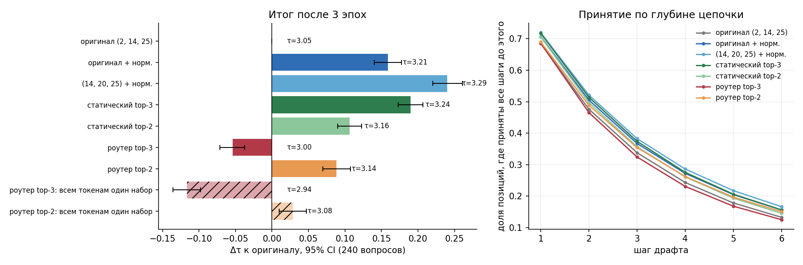

# EAGLE-3: воспроизведение и исследование

Yandex & Sirius Research Program 2026.

**EAGLE-3** ускоряет генерацию больших языковых моделей. Маленькая модель-драфт быстро угадывает несколько следующих токенов, а большая модель (её называют target) проверяет все догадки за один проход. Чем больше токенов принято за один проход, тем быстрее генерация. Эту величину мы обозначаем **τ**: τ = 3 значит, что за один проход большой модели получается в среднем 3 токена вместо одного.

Чтобы угадывать лучше, драфт подглядывает во внутренние состояния большой модели — в три её слоя. Какие это слои, в EAGLE-3 зашито в код, и они одинаковы для любой модели.

## Что мы выяснили

- **Статья воспроизводится.** На DeepSeek-R1-Distill-Llama-8B наши τ на 5–12 % ниже заявленных.
- **Слои, которые берёт EAGLE-3, выбраны не лучшим образом.** Самый нижний из трёх почти не используется. Лучше брать слой примерно на 70 % глубины сети и выравнивать масштаб слоёв: это даёт до +8 % τ без лишних параметров.
- **Сложный выбор слоёв (роутер, MoE) пока не даёт выигрыша** по сравнению с удачной фиксированной тройкой. Проверка на второй модели идёт.
- **Вне английского ускорение почти исчезает.** На русском и японском τ около 1,6–2: у драфта урезанный словарь.

## Направления

| | Что изучаем | Статус |
|---|---|---|
| [Выбор слоёв](layer-selection/) | Какие слои большой модели нужны драфту и стоит ли выбирать их автоматически | Qwen3-1.7B — готово, DSL-8B — считается |
| [Дополнительные проверки](extra-checks/) | Воспроизводимость, разные языки, 11 публичных драфтов | готово |

В каждой папке — короткий README, отчёт в PDF (`reports/`), графики (`figures/`), результаты (`results/`) и код (`code/`).

Правила для тех, кто дописывает репозиторий, в том числе для ИИ-агентов, — в [AGENTS.md](AGENTS.md).
