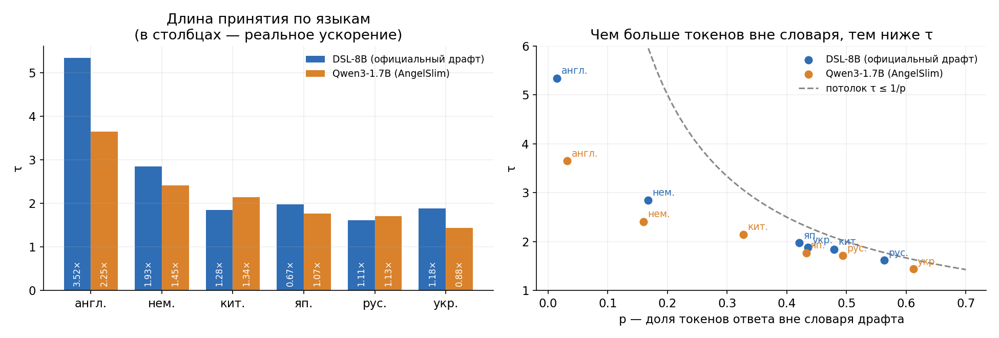

# Дополнительные проверки

Подробно — в [отчёте](reports/eagle3_summary.pdf).

- **Воспроизводимость.** На DeepSeek-R1-Distill-Llama-8B наши τ — 5,28 / 6,08 / 5,84 (MT-bench / GSM8K / HumanEval) против 5,58 / 6,93 / 6,38 в статье. Попутно нашли, что официальный скрипт оценки обрезает ответы на 512 токенах, а не на 1024, как заявлено.
- **Языки.** На английском DSL-8B ускоряет генерацию в 3,5 раза, на русском — всего в 1,1 раза, а на японском даже замедляет. Причина — урезанный словарь драфта, 32 тыс. токенов: на других языках треть и больше токенов ответа в него не входят, и драфт их просто не может предложить.
- **11 публичных драфтов для Qwen3-8B.** Для одной и той же модели τ разных драфтов отличается почти вдвое: от 2,6 до 4,8. Если включить у модели режим рассуждений, драфты теряют от 4 до 33 %.
- **Данные важнее архитектуры.** Драфты, обученные на одних данных, но с разной архитектурой, дают почти одинаковую τ (±0,02).
- **Геометрия.** Независимые драфты «смотрят» в одни и те же направления внутри большой модели, и почти весь сигнал берут из верхнего слоя.

## Что где

- [`code/zoo_eval.py`](code/zoo_eval.py) — сравнение 11 драфтов: `download` (Qwen3-8B и драфты с Hugging Face), `gen` (ответы модели), `eval` (τ каждого драфта). Команды `check` и `validate` сверяют наш офлайн-расчёт τ с самим EAGLE.
- [`code/zoo.py`](code/zoo.py) — загрузка драфтов трёх форматов (EAGLE, speculators, DeepSeek) и их прогон на готовом тексте.
- [`code/zoo_geometry.py`](code/zoo_geometry.py) — геометрия: какие направления признаков модели читают разные драфты.
- Языки — [`languages.py`](../layer-selection/frozen/code/languages.py) в папке замороженного драфта.
- `results/` — результаты, `figures/` — графики (`code/make_figures.py`).
