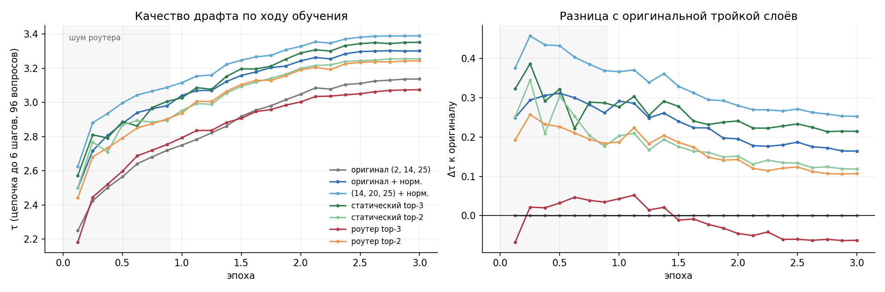

# Какие слои большой модели нужны драфту

## Вопрос

Драфт EAGLE-3 получает на вход три внутренних состояния большой модели — из слоёв 2, N/2 и N−3, где N — число слоёв. Их склеивают и сжимают одной матрицей:

$$g = W\,[\,h_2;\ h_{N/2};\ h_{N-3}\,]$$

Слои одинаковы для любой модели. Мы проверяли, почему именно они, нельзя ли выбрать лучше и поможет ли, если модель будет выбирать слои сама — через роутер или MoE (без лишних параметров).

## Что сделали

1. **[Драфт заморожен](frozen/).** Отключали слои у готовых драфтов, перебирали слои по одному, переобучали только входную матрицу, пробовали MoE. Модели: DeepSeek-R1-Distill-Llama-8B (DSL-8B) и Qwen3-1.7B.
2. **[Драфт обучается целиком](router/),** а слои выбирает роутер: два или три слоя, одни для всех токенов или свои для каждого. Qwen3-1.7B готово, DSL-8B считается.

Подробно — в отчётах: [замороженный драфт](reports/eagle3_layers.pdf), [роутер](reports/eagle3_routed.pdf).

## Что получилось

На Qwen3-1.7B, драфт обучается целиком, 240 отложенных вопросов:

| Какие слои | τ | Выигрыш |
|---|---|---|
| Оригинал: 2, 14, 25 | 3,05 | — |
| Оригинал + выравнивание масштаба слоёв | 3,21 | +5 % |
| **14, 20, 25 + выравнивание** | **3,29** | **+8 %** |
| Роутер, общий для всех токенов: выбрал 21, 24, 27 | 3,24 | +6 % |
| Роутер для каждого токена | 3,00–3,14 | −2…+3 % ⚠️ |

⚠️ У пословного роутера в этом запуске выбор застывал в самом начале обучения. Ошибка исправлена, исправленная версия считается на DSL-8B.

## Что это значит

- **Слой 2 почти не нужен.** Если его убрать, τ падает всего на 2–6 %, а без слоя N−3 — на 40–68 %.
- **Лучшая зона — около 70 % глубины сети и около N−3.** Это видно и при ручном переборе, и по тому, что выбирает роутер.
- **Выравнивание масштаба слоёв — самый дешёвый выигрыш.** Глубокие слои численно в десятки раз «громче» мелких.
- **Роутер, общий для всех токенов, сам находит нужные слои,** почти без потери качества.
- **Выигрыш уменьшается по мере обучения** (+0,45 → +0,25 τ). При полном объёме данных статьи он может быть меньше.

## Что дальше

- Результаты DSL-8B: проверить, что выводы переносятся на другую архитектуру.
- Понять, хватает ли данных: сравнить с официальным драфтом на тех же вопросах.
