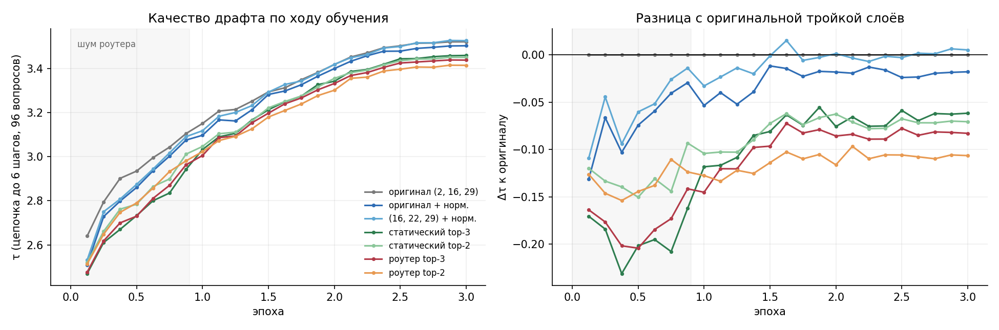

# Какие слои большой модели нужны драфту

## Вопрос

Драфт EAGLE-3 получает на вход три внутренних состояния большой модели — из слоёв 2, N/2 и N−3, где N — число слоёв. Их склеивают и сжимают одной матрицей:

$$g = W \cdot [h_2 ; h_{N/2} ; h_{N-3}]$$

Слои одинаковы для любой модели. Мы проверяли, почему именно они, нельзя ли выбрать лучше и поможет ли, если модель будет выбирать слои сама — через роутер или MoE (без лишних параметров).

## Что сделали

1. **[Драфт заморожен](frozen/).** Отключали слои у готовых драфтов, перебирали слои по одному, переобучали только входную матрицу, пробовали MoE. Модели: DeepSeek-R1-Distill-Llama-8B (DSL-8B) и Qwen3-1.7B.
2. **[Драфт обучается целиком](router/),** а слои выбирает роутер: два или три слоя, одни для всех токенов или свои для каждого. Модели: Qwen3-1.7B и DSL-8B.

Подробно — в отчётах: [замороженный драфт](reports/eagle3_layers.pdf), [роутер](reports/eagle3_routed.pdf); схема обучения входа драфта — [method5_scheme.pdf](reports/method5_scheme.pdf).

## Что получилось

Драфт обучается целиком, 240 отложенных вопросов, τ:

| Какие слои | Qwen3-1.7B | DSL-8B |
|---|---|---|
| Оригинал: 2, N/2, N−3 | 3,05 | 3,48 |
| Оригинал + выравнивание масштаба слоёв | 3,21 (+5 %) | 3,46 (−0,5 %) |
| **N/2, 0,7N, N−3 + выравнивание** | **3,29 (+8 %)** | **3,48 (ничья)** |
| Роутер, общий для всех токенов, top-3 | 3,24 (+6 %) | 3,42 (−2 %) |
| Роутер для каждого токена | 3,00–3,14 ⚠️ | 3,37–3,40 (−2…−3 %) |
| Официальный драфт с родным входом | — | 4,18 |

⚠️ На Qwen у пословного роутера выбор застывал в начале обучения; на DSL-8B считалась исправленная версия.

## Что это значит

- **Слой 2 почти не нужен.** Если его убрать, τ падает всего на 2–6 %, а без слоя N−3 — на 40–68 %. Ни один роутер его не выбрал.
- **Полезная зона одна на обеих моделях — около 70 % глубины и самый верх.** Роутер, общий для всех токенов, сам пришёл к слоям 21, 24, 27 у Qwen и 22, 26, 30 у DSL.
- **Выигрыш от другой тройки зависит от исходного драфта.** Обучаемый драфт стартует с весов под оригинальные слои. У слабого драфта Qwen это почти не мешает (+8 %), у сильного официального драфта DSL оригинал держит фору, и получается ничья.
- **Выбирать слои для каждого токена не нужно.** Даже исправленный роутер почти всегда выбирает одно и то же; если дать всем токенам один набор, τ почти не меняется.
- **Данных мало.** На DSL-8B наши варианты на 17 % хуже официального драфта на тех же вопросах, и τ росла до конца обучения. Сравнение вариантов между собой честное, но абсолютные цифры занижены.

## Что дальше

- Обучить лучшие варианты на полном объёме данных и без форы оригинальных слоёв (драфт с нуля для каждого варианта).
- Замерить реальную скорость лучших вариантов в генерации деревом.
