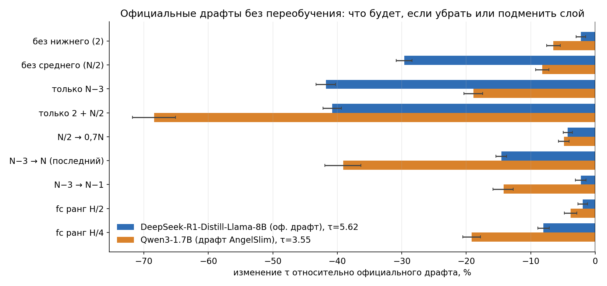

# Драфт заморожен

Берём готовые драфты и не меняем их: смотрим, на какие слои они опираются и что будет, если подать другие.

## Главное

- **Без слоя 2 почти ничего не теряется:** −2 % τ у DSL-8B, −6 % у Qwen3-1.7B. Без слоя N−3 — минус 40–68 %.
- **Лучший одиночный слой — около 70 % глубины:** слой 23 у DSL-8B, 20 у Qwen3-1.7B.
- **Если переобучить только входную матрицу (Qwen3-1.7B):** тройка 14, 20, 25 с выравниванием масштаба даёт τ 3,80 против 3,37 у оригинала. Смесь всех слоёв и MoE лучше не стали.

## Как мы «убирали» и подменяли слои

Драфт и его входная матрица при этом не менялись — мы трогали только то, что подаётся на вход.

- **«Убрать слой» = заменить его средним вектором.** Заранее прогнали большую модель по 300 диалогам UltraChat (~30 тыс. токенов) и посчитали для каждого слоя средний вектор. Вместо настоящего состояния слоя драфт получал этот средний вектор — один и тот же для всех токенов. Так из входа пропадает всё, что зависит от конкретного токена, но масштаб и «типичное» значение сохраняются. Если бы мы подали нули, драфт увидел бы вход, которого никогда не встречал, и упал бы сильнее, чем от самой потери информации.
- **«Заменить слой другим»** (например, 16 → 22 или N−3 → последний). Брали состояние другого слоя и масштабировали его так, чтобы средняя длина вектора совпала с исходным слоем: у глубоких слоёв векторы намного длиннее.
- **«Урезать матрицу»** — оставляли только старшие компоненты её SVD (ранг H/2 или H/4).

τ мерили настоящей генерацией EAGLE по протоколу статьи на 160 вопросах MT-bench и GSM8K, интервалы — парный bootstrap по вопросам. Код — `Edit` в стадии `eval_official` файла `code/run.py`.

## Что где

- `code/run.py` — все прогоны на H200: абляции по протоколу статьи, генерация данных, перебор слоёв, переобучение входа, языки.
- `code/layer_lab.py` — общая библиотека для этих опытов.
- `code/phase_a.py`, `code/phase_b.py` — те же опыты для Kaggle T4.
- `results/h200/` — результаты и логи H200, `results/kaggle_*` — Kaggle.
- `figures/` — графики (`code/make_figures*.py`).
