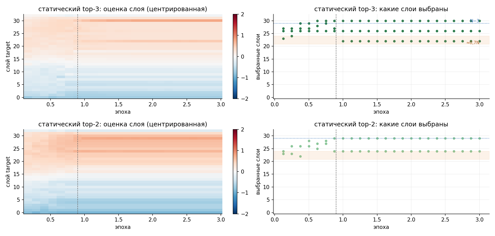

# Роутер слоёв: драфт обучается целиком

Вместо фиксированной тройки слоёв маленький модуль сам выбирает 2 или 3 слоя из всех. Дальше всё как в оригинале: выбранные состояния склеиваются и сжимаются одной матрицей. Драфт дообучается целиком, большая модель не меняется. Семь вариантов учатся параллельно на одних и тех же данных:

- **оригинальные слои** — как есть и с выравниванием масштаба;
- **лучшая тройка** из опытов с замороженным драфтом;
- **роутер, общий для всех токенов** — 3 или 2 слоя;
- **роутер, свой для каждого токена** — 3 или 2 слоя.

## Результаты

Итоги и выводы — в [README направления](../README.md) и [отчёте](../reports/eagle3_routed.pdf).

- **Qwen3-1.7B** — `results/qwen3-1.7b/`, графики в `figures/`.
- **DSL-8B** — `results/dsl-8b/` (история обучения, итоговая оценка, `probe.txt` — сравнение с официальным драфтом и обнуление частей входа), графики в `figures/dsl-8b/`. Официальный драфт через наш код (`code/sanity.py`) даёт τ 4,24, то есть код его воспроизводит.

Как менялся выбор слоёв статическим роутером на DSL-8B:



## Как запустить

```bash
bash code/run_dsl.sh     # всё сразу: окружение, модели, данные, проверка, обучение, итоговая оценка
```

Если прогон прервался, тот же запуск продолжит обучение с последнего сохранения.

## Что где

- `code/` — код. Начинать с `fusion.py`: там выбор слоёв. `original/` — код, на котором шёл запуск Qwen; `check_equivalence.py` подтверждает, что читаемая версия считает то же самое.
- `results/<модель>/` — история обучения и итоговая оценка.
- `figures/` — графики.
