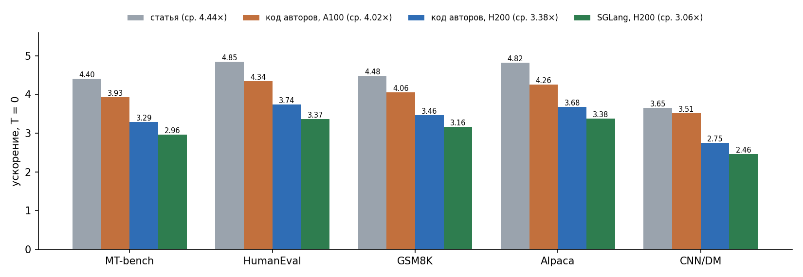
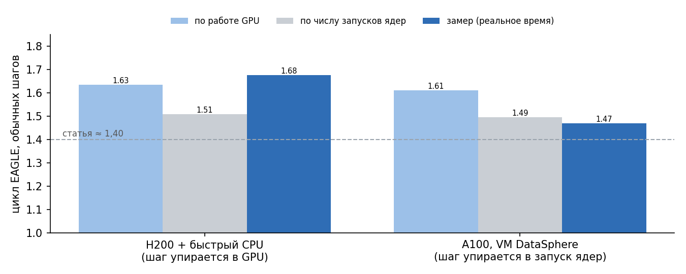
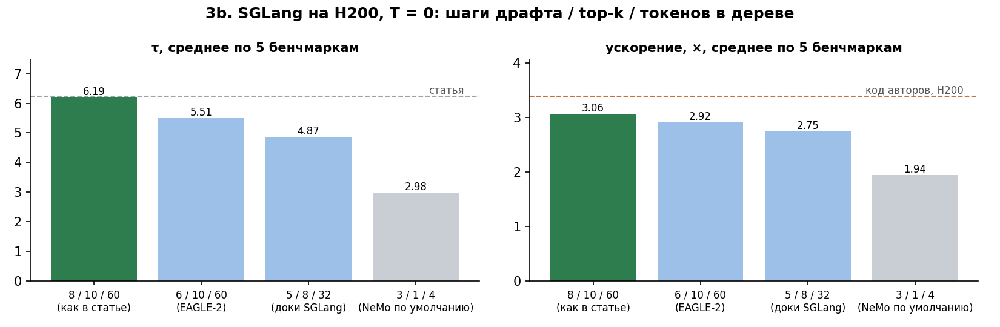
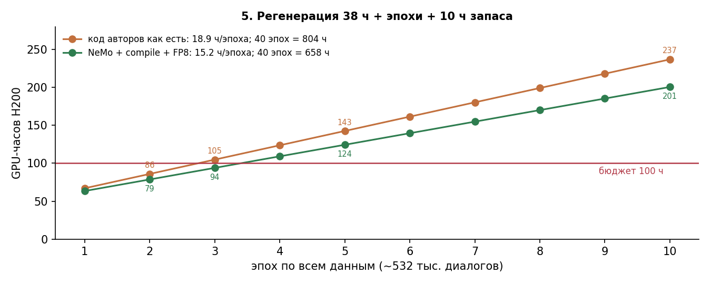

# Воспроизведение EAGLE-3 и скорость

**Вопрос.** Сколько реально даёт EAGLE-3 на LLaMA-3.1-8B-Instruct, если взять официальный драфт авторов? Насколько быстрее оптимизированный движок (SGLang, через него NeMo отдаёт драфты) и тренер NeMo AutoModel по сравнению с кодом статьи? Хватит ли 100 GPU-часов, чтобы обучить драфт с нуля?

Задачи команды:
- **3a** — код статьи;
- **3b** — SGLang;
- **4** — скорость обучения: код авторов против NeMo;
- **5** — бюджет GPU-часов.

Всё посчитано на одной H200 NVL. Для проверки гипотезы про железо 3a и профиль повторены на A100-SXM4-80GB (Yandex DataSphere).

Отчёты:
- [reports/eagle3_reproduction.pdf](reports/eagle3_reproduction.pdf) — все задачи;
- [reports/eagle3_profile.pdf](reports/eagle3_profile.pdf) — почему ускорение ниже статьи (профили H200 и A100).



## Главное

| Задача | Статус | Результат |
|---|---|---|
| **3a.** Код авторов, официальный драфт | ✅ | **τ воспроизведён в пределах ~1 %**: 6,25 против 6,23 (T = 0), 4,91 против 4,92 (T = 1). Ускорение ниже: на H200 3,38× против 4,44× (T = 0), 2,72× против 3,48× (T = 1); **на A100 4,02×** (T = 0) |
| **3b.** Тот же драфт в SGLang | ✅ | Дерево как в статье: **3,06×**, τ 6,19 (T = 0); 2,56× (T = 1). Абсолютно быстрее кода авторов в ~1,9 раза (~555 против ~293 ток/с). **Дерево NeMo по умолчанию (3/1/4) — только 1,94×** |
| **4.** Шаг обучения: код авторов против NeMo | ✅ | Каждый в своих настройках: NeMo быстрее в **1,06×** (packing), **1,22×** (+ torch.compile), **1,24×** (+ compile + FP8). На одинаковой работе — 1,38× |
| **5.** Бюджет GPU-часов | ✅ | Регенерация 38 ч + эпоха 15–19 ч. **В 100 ч H200 помещаются 2–3 эпохи по всем данным.** 40 эпох, как у авторов, — ~660–800 ч |

## 3a. Код авторов

Скрипты оценки авторов без изменений, официальный драфт `yuhuili/EAGLE3-LLaMA3.1-Instruct-8B`, 5 бенчмарков по 80 вопросов. Дерево как в статье EAGLE-3: 60 токенов, глубина 8 (`--depth 7`), top-k 10.

| | T = 0, статья | T = 0, H200 | T = 0, A100 | T = 1, статья | T = 1, H200 |
|---|---|---|---|---|---|
| MT-bench | 4,40× / τ 6,13 | 3,29× / 6,18 | 3,93× / 6,19 | 3,07× / 4,24 | 2,34× / 4,12 |
| HumanEval | 4,85× / 6,74 | 3,74× / 6,74 | 4,34× / 6,75 | 4,13× / 5,82 | 3,17× / 5,81 |
| GSM8K | 4,48× / 6,23 | 3,46× / 6,26 | 4,06× / 6,28 | 3,32× / 4,59 | 2,98× / 4,84 |
| Alpaca | 4,82× / 6,70 | 3,68× / 6,70 | 4,26× / 6,73 | 3,90× / 5,56 | 2,91× / 5,29 |
| CNN/DM | 3,65× / 5,34 | 2,75× / 5,39 | 3,51× / 5,39 | 2,99× / 4,39 | 2,19× / 4,48 |
| **среднее** | **4,44× / 6,23** | **3,38× / 6,25** | **4,02× / 6,27** | **3,48× / 4,92** | **2,72× / 4,91** |

**Что это значит.**
- **τ совпал со статьёй на обеих картах.** τ — сколько токенов принимается за один проход большой модели. Он зависит только от драфта, дерева и протокола, значит всё это воспроизведено.
- **Ускорение = τ / стоимость цикла EAGLE** (драфт + проверка дерева) в шагах обычной генерации. Цикл стоит: у авторов ≈ 1,40 шага, на A100 1,56, на H200 1,85.
- **Почему так, показали профили H200 и A100** ([results/profile_3a.md](results/profile_3a.md), [results/a100.md](results/a100.md)):
  - **по работе GPU цикл стоит ~1,6 обычного шага на обеих картах.** Это свойство кода: драфт — 900 мелких ядер, проверка дерева — почти целый проход модели;
  - **по числу запусков ядер — ~1,5 шага;**
  - **на H200 с быстрым CPU** шаг упирается в работу GPU, поэтому цикл ≈ 1,64–1,85 шага;
  - **на A100 в виртуалке DataSphere** CPU запускает ядро ~22 мкс (на H200 ~7 мкс). Шаг упирается в запуски, поэтому цикл ≈ 1,47 шага и ускорение 4,0–4,3×.
- **Итог: ускорение — отношение к обычной генерации на той же машине.** Чем она медленнее, тем оно больше. Цифра статьи достигается на ~91 % на «медленной» машине. В абсолютной скорости H200 быстрее A100 в 2,8 раза (~293 против 106 ток/с с EAGLE). Остаток ~10 % до статьи объяснить конкретной причиной мы не можем.
- **Прошлая гипотеза не подтвердилась.** Мы предполагали, что мелкие ядра драфта не ускоряются на быстрой памяти, и предсказывали цикл ≈ 1,40 на A100. На деле на A100 все ядра медленнее примерно в 2 раза, включая ядра драфта.
- **Глубина дерева важна.** С `--depth 5` (значение по умолчанию в скрипте авторов, дерево EAGLE-2) τ был на 10 % ниже: 5,55 против 6,25 при T = 0, ускорение 3,16×.



## 3b. SGLang

SGLang 0.5.9, тот же драфт и вопросы, вопросы по одному, время — полный HTTP-запрос. Ускорение — относительно обычного сервера SGLang. Деревья — «шаги драфта / top-k / токенов». Подробно — в [results/sglang_3b.md](results/sglang_3b.md).

| дерево | ускорение, T = 0 | τ, T = 0 | ускорение, T = 1 (3 seed) |
|---|---|---|---|
| **8 / 10 / 60 (как в статье)** | **3,06×** | **6,19** | 2,57× ± ≤ 0,03 |
| 6 / 10 / 60 (EAGLE-2) | 2,92× | 5,51 | — |
| 5 / 8 / 32 (пример из документации SGLang) | 2,75× | 4,87 | — |
| 3 / 1 / 4 (NeMo по умолчанию) | 1,94× | 2,98 | — |
| *код авторов, H200* | *3,38×* | *6,25* | *2,72×* |

**Что это значит.**
- **τ в SGLang тот же**, драфт работает одинаково.
- **Ускорение ниже, абсолютная скорость выше.** SGLang (CUDA graphs, слитые ядра) ускоряет обычную генерацию сильнее (~181 против ~87 ток/с), чем EAGLE (~555 против ~293). Отношение к более быстрой базе меньше.
- **Дерево NeMo по умолчанию теряет треть ускорения** (1,94× против 3,06×). Для реальной отдачи нужно 8 / 10 / 60.



## 4. Скорость шага обучения

Одни и те же 1000 примеров и словарь драфта на 32K, одна H200, замер по шагам оптимизатора после 20 шагов прогрева. Полная таблица — в [results/training_speed.md](results/training_speed.md).

| Запуск | Что это | Токенов/с | Относительно авторов как есть |
|---|---|---|---|
| `original_asis` | код авторов в своих настройках: fp16, gradient checkpointing, без паддинга | 6 925 | 1,00× |
| `nemo_eager_pack` | NeMo, упаковка примеров в строки по 2048 | 7 326 | 1,06× |
| `nemo_compile` | + torch.compile | 8 454 | 1,22× |
| `nemo_compile_fp8` | + FP8 | 8 577 | **1,24×** |
| `original` / `nemo_eager_nopack` | одинаковая работа: BF16, каждый пример дополнен до 2048 | 1 638 / 2 259 | NeMo быстрее в 1,38× |

**Что это значит.**
- **Выигрыш NeMo при обучении скромный — около 1,2×.** Код авторов не тратит время на паддинг: micro-batch 1, каждый пример своей длины. Главный приём NeMo — упаковка — даёт по сути то же.
- **torch.compile даёт +15 %, FP8 — ещё +1,5 %.** Драфт — один слой, его матрицы слишком малы, чтобы FP8 окупился.
- **Память: 28–37 ГБ из 141 ГБ на H200.** Запас можно использовать для большего батча.
- **Оговорки:**
  - сравнивается скорость двух стеков, а не одинаковое обучение (разные версии torch, детали loss);
  - данные — PerfectBlend, а не датасет статьи;
  - flash-attn 2 не проверен.

## 5. Бюджет GPU-часов

Регенерация ответов таргетом (как в статье) + обучение. Корпус: ShareGPT 68 623 диалога (68K статьи) + UltraChat-200K 208K + 256K. Подробно — в [results/budget_5.md](results/budget_5.md).

| | Код авторов | NeMo + compile + FP8 |
|---|---|---|
| регенерация (один раз) | 38 ч | 38 ч |
| эпоха | 18,9 ч | 15,3 ч |
| **все данные в 100 ч (10 ч запаса)** | **2 эпохи** (86 ч) | **3 эпохи** (94 ч) |
| 5 эпох в 100 ч | 68 % данных | 79 % данных |
| 40 эпох, как в конфиге авторов | 804 ч | 658 ч |

**Что это значит.**
- **Полное воспроизведение (40 эпох) стоит ~660–800 GPU-часов H200, в 6–8 раз больше бюджета.**
- **В 100 ч — 2–3 эпохи по всем данным.** Урезать лучше эпохи, а не данные: главный результат EAGLE-3 — рост качества драфта с объёмом данных.
- **Регенерация, скорее всего, посчитана с запасом:** группы по 64 с «хвостом», кэш KV занят на 3 %. Большой батч может ускорить её в 2–4 раза, это не замерено.
- **A100 для обучения невыгодна:** по оценке в ~2,5 раза медленнее и без FP8, одна регенерация — ~95 ч.



## Найденное в коде авторов

- `--depth 5` по умолчанию в скрипте оценки — это дерево EAGLE-2; для EAGLE-3 нужно `--depth 7` (глубина 8 в статье).
- `--max-new-token 1024` в скрипте объявлен, но в генерацию не передаётся: фактический лимит ответа — 512.
- Опубликованный тренер `traineagle3` падает при запуске (`self.train_config.gradient_checkpointing` при словаре); исправляем в копии.
- `speed.py` считает только ускорение; τ берём по определению статьи из счётчиков генератора.

## Результаты: где что

| Файл | Что внутри |
|---|---|
| [results/author_3a.md](results/author_3a.md) | 3a на H200: все прогоны кода авторов, глубина 8 и 6, T = 0 и 1, ток/с |
| [results/a100.md](results/a100.md) | 3a на A100 (T = 0) и профиль A100 против H200 |
| [results/profile_3a.md](results/profile_3a.md) | профиль H200: из чего состоит цикл EAGLE, картинки; в конце — что изменил замер на A100 |
| [results/profile_raw_summary.md](results/profile_raw_summary.md) | сырой вывод `profile_eagle.py` на H200 (с пометкой, какие колонки там неверны) |
| [results/sglang_3b.md](results/sglang_3b.md) | 3b: SGLang, четыре дерева, T = 0 и 1, абсолютные ток/с |
| [results/training_speed.md](results/training_speed.md) | 4: полная таблица скорости шага обучения |
| [results/budget_5.md](results/budget_5.md) | 5: регенерация, часы на эпоху, сценарии на 100 ч |
| [results/numbers.json](results/numbers.json) | все числа отчётов и графиков в одном файле |

## Структура

Код разложен по двум папкам, которые должны лежать рядом. Почему две: в `inference_speed` всё общее и всё про генерацию (3a, 3b, 5), а также оркестратор, который запускает и обучение. В `nemo_speed` — только то, что трогает код обучения авторов (задача 4), и рабочие файлы обучения.

```
reproduction/
├── README.md                    ← этот файл: вопрос, результаты, как запустить
├── reports/                     PDF-отчёты
├── results/                     таблицы по задачам (*.md) и все числа отчётов (numbers.json)
├── figures/                     графики отчётов
└── code/
    ├── make_report_figures.py   графики из results/numbers.json
    ├── inference_speed/         ← отсюда всё запускается
    │   ├── night.sh             запуск всей ночи (check.sh — короткая проверка на 2 вопросах)
    │   ├── author.sh            только код авторов на другой машине (A100): профиль, затем 3a
    │   ├── orchestrate.py       ★ начать чтение отсюда: план ночи и все стадии по порядку
    │   ├── common.py            закреплённые версии, запись файлов, отметки «готово», процессы
    │   │
    │   │   3a / 3b — ускорение генерации
    │   ├── profile_eagle.py     3a: куда уходит время цикла EAGLE (фазы, torch.profiler)
    │   ├── plot_profile.py      картинки профиля и GPU-работа по фазам
    │   ├── sglang_client.py     3b: вопросы серверу SGLang по одному, замер каждого ответа
    │   ├── setup_cuda.sh        3b: nvcc и gcc для JIT-ядер SGLang на сервере без CUDA toolkit
    │   ├── summarize.py         таблица 3a + 3b: статья vs код авторов vs SGLang
    │   │
    │   │   4 — скорость обучения
    │   ├── train_nemo.py        рецепт NeMo на наших данных, с секундомером
    │   ├── training_common.py   общие для двух тренеров данные, словарь и секундомер
    │   ├── nemo_config.yaml     шаблон конфига NeMo
    │   ├── stamp_and_summarize.py  таблица скорости обучения
    │   │
    │   │   5 — бюджет
    │   ├── regen_probe.py       проба: как быстро таргет переписывает обучающие диалоги
    │   ├── budget.py            GPU-часы при 1–40 эпохах против 100 ч
    │   │
    │   ├── download.py          скачивание моделей с проверкой целостности
    │   ├── test_regressions.py  быстрые тесты без GPU
    │   ├── README.md            как устроен код и как считаются числа
    │   └── FIXES.md             найденные проблемы и исправления
    │
    └── nemo_speed/              ← только задача 4
        ├── prepare_data.py      1000 обучающих примеров (токенизация функцией авторов) и словарь на 32K
        ├── patch_original.py    копия тренера авторов, подправленная для замера (список правок — в начале файла)
        └── run.sh               запуск только обучения
```

При запуске на сервере внутри этих папок появляются (в git не попадают):
- **окружения** `venv_*`, `Automodel/.venv`;
- **клоны** `EAGLE/` и `Automodel/`;
- **модели** `models/`;
- **результаты** `results/`, `logs/`, `nemo_speed/artifacts/`.

**Как читать код.** Начни с `orchestrate.py`: в его начале план ночи, а каждая стадия — отдельная функция (`author_benchmarks`, `profile`, `sglang_benchmarks`, `training_speed`, `regeneration_probe`, `budget`). Из стадии видно, какой скрипт она вызывает. Дальше по задаче:
- **3a** — сам код авторов, мы его не меняем. Как считаются числа — в `summarize.py`, профиль — `profile_eagle.py` и `plot_profile.py`.
- **3b** — `sglang_client.py`, потом `summarize.py`.
- **4** — `nemo_speed/prepare_data.py` (данные), затем `nemo_speed/patch_original.py` (тренер авторов) и `train_nemo.py` (NeMo); секундомер у обоих общий, в `training_common.py`.
- **5** — `regen_probe.py`, потом `budget.py`.

Проверить без GPU: `py -3.12 -X utf8 code/inference_speed/test_regressions.py`.

## Как запускать

```bash
cd code/inference_speed && NIGHT_SECONDS=26400 nohup setsid bash night.sh > night.out 2>&1 &
```

Один запуск сам ставит окружения, качает закреплённые версии моделей и кода и проходит все стадии. Готовые стадии при перезапуске пропускаются. Упавшая стадия не останавливает остальные.

Только код авторов на другой машине (профиль, затем 3a; `AUTHOR_TEMPERATURES=0` — только T = 0):

```bash
cd code/inference_speed && NIGHT_SECONDS=36000 nohup setsid bash author.sh > author.out 2>&1 &
```

Где итоги:
- `results/main/summary.md` — 3a и 3b;
- `results/main/profile/` — профиль (`summary.md`, `figures/phases.md` и картинки);
- `../nemo_speed/artifacts/main/summary.txt` — задача 4;
- `results/main/budget.md` — задача 5.

Протокол подробно описан в [`code/inference_speed/README.md`](code/inference_speed/README.md), история исправлений — в [`FIXES.md`](code/inference_speed/FIXES.md).

## Что дальше

Задачи 3a, 3b, 4 и 5 закрыты. Драфт мы пока не обучали: обучение оценено, но не проведено. Следующие шаги:
- **замерить то, что может сдвинуть бюджет:** регенерация батчем 256+, профиль шага обучения, больший микро-батч, SDPA-flash;
- **пробное обучение** (1–3 эпохи на части данных) с ранней остановкой по τ на отложенной выборке: нужны ли вообще 40 эпох;
- **все прогоны 3a, включая глубину 6,** — в [results/author_3a.md](results/author_3a.md).
