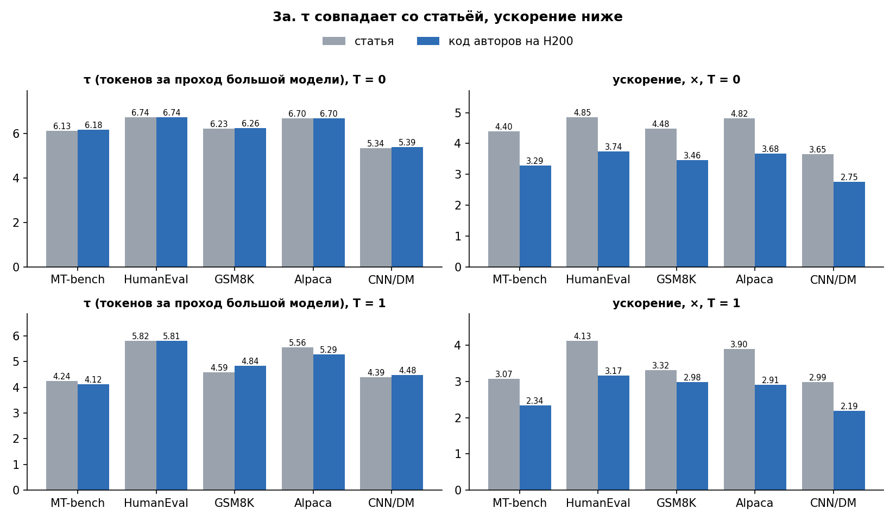

# Воспроизведение EAGLE-3 и скорость

**Вопрос.** Сколько реально даёт EAGLE-3 на LLaMA-3.1-8B-Instruct, если взять официальный драфт авторов? Насколько быстрее оптимизированный движок (SGLang, через него NeMo отдаёт драфты) и тренер NeMo AutoModel по сравнению с кодом статьи? Хватит ли 100 GPU-часов, чтобы обучить драфт с нуля?

Задачи команды:
- **3a** — код статьи;
- **3b** — SGLang;
- **4** — скорость обучения: код авторов против NeMo;
- **5** — бюджет GPU-часов.

Всё считается на одной H200.

Отчёт для чтения: [reports/eagle3_reproduction.pdf](reports/eagle3_reproduction.pdf) (промежуточный, без 3b и бюджета).



## Главное

| Задача | Статус | Результат |
|---|---|---|
| **3a.** Код авторов, официальный драфт | ✅ | **τ воспроизведён в пределах ~1 %**: 6,25 против 6,23 в статье (T = 0), 4,91 против 4,92 (T = 1). Ускорение ниже: 3,38× против 4,44× (T = 0), 2,72× против 3,48× (T = 1) |
| **3b.** Тот же драфт в SGLang | ⏳ чиним запуск сервера | — |
| **4.** Шаг обучения: код авторов против NeMo | ✅ | Каждый в своих настройках: NeMo быстрее в **1,06×** (packing), **1,22×** (+ torch.compile), **1,24×** (+ compile + FP8). На одинаковой работе — 1,38× |
| **5.** Бюджет GPU-часов | ⏳ после 3b | Предварительно: ~8,5 тыс. токенов/с на H200, эпоха полного датасета ≈ 12 ч; 40 эпох (как в коде авторов) в 100 ч не помещаются |

## 3a. Код авторов

Скрипты оценки авторов без изменений, официальный драфт `yuhuili/EAGLE3-LLaMA3.1-Instruct-8B`, 5 бенчмарков по 80 вопросов, одна H200. Дерево — как в статье EAGLE-3: 60 токенов, глубина 8 (`--depth 7`), top-k 10.

| | T = 0, статья | T = 0, у нас | T = 1, статья | T = 1, у нас |
|---|---|---|---|---|
| MT-bench | 4,40× / τ 6,13 | 3,29× / τ 6,18 | 3,07× / 4,24 | 2,34× / 4,12 |
| HumanEval | 4,85× / 6,74 | 3,74× / 6,74 | 4,13× / 5,82 | 3,17× / 5,81 |
| GSM8K | 4,48× / 6,23 | 3,46× / 6,26 | 3,32× / 4,59 | 2,98× / 4,84 |
| Alpaca | 4,82× / 6,70 | 3,68× / 6,70 | 3,90× / 5,56 | 2,91× / 5,29 |
| CNN/DM | 3,65× / 5,34 | 2,75× / 5,39 | 2,99× / 4,39 | 2,19× / 4,48 |
| **среднее** | **4,44× / 6,23** | **3,38× / 6,25** | **3,48× / 4,92** | **2,72× / 4,91** |

**Что это значит.**
- **τ совпал со статьёй.** τ — сколько токенов принимается за один проход большой модели — зависит только от драфта, дерева и протокола. Совпадение в пределах ~1 % при обеих температурах значит, что всё это воспроизведено.
- **Ускорение равно τ, делённому на стоимость цикла EAGLE** (драфт + проверка дерева), выраженную в шагах обычной генерации.
  - У нас цикл стоит **~1,85 обычного шага, у авторов — ~1,40.**
  - На H200 обычная генерация быстрая (~90 токенов/с), а накладные расходы цикла — вызовы из Python, мелкие операции с деревом — почти не сокращаются.
  - Это свойство железа и окружения, а не драфта. На каком GPU сделана Table 1, в статье не указано.
- **Профиль ([results/profile_3a.md](results/profile_3a.md)).** Цикл EAGLE дороже обычного шага в 1,64× уже по работе GPU: драфт — 885 микроскопических ядер (3,6 мс), проверка 60 токенов — 9,7 мс против 8,2 мс обычного шага. Эти ядра почти не ускоряются на быстром GPU, а обычный шаг на H200 очень быстрый (веса 16 ГБ читаются за 3,3 мс). Если подставить память A100, цикл выходит ≈ 1,40 шага и ускорение ≈ 4,5× — как в статье. CPU (EPYC 9555) быстрый и не причина.
- **Глубина дерева важна.** С `--depth 5` (значение по умолчанию в скрипте авторов, дерево EAGLE-2) τ был на 10 % ниже: 5,55 против 6,25 при T = 0, ускорение 3,16×.

## 4. Скорость шага обучения

Одни и те же 1000 примеров и словарь драфта на 32K, одна H200, замер по шагам оптимизатора после 20 шагов прогрева. Полная таблица — в [results/training_speed.md](results/training_speed.md).

| Запуск | Что это | Токенов/с | Относительно авторов как есть |
|---|---|---|---|
| `original_asis` | код авторов в своих настройках: fp16, gradient checkpointing, без паддинга | 6 925 | 1,00× |
| `nemo_eager_pack` | NeMo, упаковка примеров в строки по 2048 | 7 326 | 1,06× |
| `nemo_compile` | + torch.compile | 8 454 | 1,22× |
| `nemo_compile_fp8` | + FP8 | 8 577 | **1,24×** |
| `original` / `nemo_eager_nopack` | одинаковая работа: BF16, каждый пример дополнен до 2048 | 1 638 / 2 259 | NeMo быстрее в 1,38× |

**Что это значит.**
- **Выигрыш NeMo при обучении скромный — около 1,2×.** Код авторов не тратит время на паддинг: micro-batch 1, каждый пример своей длины. Главный приём NeMo — упаковка — даёт по сути то же.
- **torch.compile даёт +15 %, FP8 — ещё +1,5 %.** Драфт — один слой, его матрицы слишком малы, чтобы FP8 окупился.
- **Память: 28–37 ГБ из 141 ГБ на H200.** Запас можно использовать для большего батча.
- **Оговорки:**
  - сравнивается скорость двух стеков, а не одинаковое обучение (разные версии torch, детали loss);
  - данные — PerfectBlend, а не датасет статьи;
  - flash-attn 2 не проверен: на сервере нет CUDA toolkit.

## Найденное в коде авторов

- `--depth 5` по умолчанию в скрипте оценки — это дерево EAGLE-2; для EAGLE-3 нужно `--depth 7` (глубина 8 в статье).
- `--max-new-token 1024` в скрипте объявлен, но в генерацию не передаётся: фактический лимит ответа — 512.
- Опубликованный тренер `traineagle3` падает при запуске (`self.train_config.gradient_checkpointing` при словаре); исправляем в копии.
- `speed.py` считает только ускорение; τ берём по определению статьи из счётчиков генератора.

## Структура

Код разложен по двум папкам, которые должны лежать рядом. Почему две: в `inference_speed` всё общее и всё про генерацию (3a, 3b, 5), а также оркестратор, который запускает и обучение. В `nemo_speed` — только то, что трогает код обучения авторов (задача 4), и рабочие файлы обучения.

```
reproduction/
├── README.md                    ← этот файл: вопрос, результаты, как запустить
└── code/
    ├── inference_speed/         ← отсюда всё запускается
    │   ├── night.sh             запуск всей ночи (check.sh — короткая проверка на 2 вопросах)
    │   ├── orchestrate.py       ★ начать чтение отсюда: план ночи и все стадии по порядку
    │   ├── common.py            закреплённые версии, запись файлов, отметки «готово», процессы
    │   │
    │   │   3a / 3b — ускорение генерации
    │   ├── sglang_client.py     3b: вопросы серверу SGLang по одному, замер каждого ответа
    │   ├── summarize.py         таблица 3a + 3b: статья vs код авторов vs SGLang
    │   │
    │   │   4 — скорость обучения
    │   ├── train_nemo.py        рецепт NeMo на наших данных, с секундомером
    │   ├── training_common.py   общие для двух тренеров данные, словарь и секундомер
    │   ├── nemo_config.yaml     шаблон конфига NeMo
    │   ├── stamp_and_summarize.py  таблица скорости обучения
    │   │
    │   │   5 — бюджет
    │   ├── regen_probe.py       проба: как быстро таргет переписывает обучающие диалоги
    │   ├── budget.py            GPU-часы при 1–40 эпохах против 100 ч
    │   │
    │   ├── download.py          скачивание моделей с проверкой целостности
    │   ├── test_regressions.py  быстрые тесты без GPU
    │   ├── README.md            как устроен код и как считаются числа
    │   └── FIXES.md             найденные проблемы и исправления
    │
    └── nemo_speed/              ← только задача 4
        ├── prepare_data.py      1000 обучающих примеров (токенизация функцией авторов) и словарь на 32K
        ├── patch_original.py    копия тренера авторов, подправленная для замера (список правок — в начале файла)
        └── run.sh               запуск только обучения
```

При запуске на сервере внутри этих папок появляются (в git не попадают):
- **окружения** `venv_*`, `Automodel/.venv`;
- **клоны** `EAGLE/` и `Automodel/`;
- **модели** `models/`;
- **результаты** `results/`, `logs/`, `nemo_speed/artifacts/`.

**Как читать код.** Начни с `orchestrate.py`: в его начале план ночи, а каждая стадия — отдельная функция (`author_benchmarks`, `sglang_benchmarks`, `training_speed`, `regeneration_probe`, `budget`). Из стадии видно, какой скрипт она вызывает. Дальше по задаче:
- **3a** — сам код авторов, мы его не меняем. Как считаются числа — в `summarize.py`.
- **3b** — `sglang_client.py`, потом `summarize.py`.
- **4** — `nemo_speed/prepare_data.py` (данные), затем `nemo_speed/patch_original.py` (тренер авторов) и `train_nemo.py` (NeMo); секундомер у обоих общий, в `training_common.py`.
- **5** — `regen_probe.py`, потом `budget.py`.

Проверить без GPU: `py -3.12 -X utf8 code/inference_speed/test_regressions.py`.

## Как запускать

```bash
cd code/inference_speed && NIGHT_SECONDS=26400 nohup setsid bash night.sh > night.out 2>&1 &
```

Один запуск сам ставит окружения, качает закреплённые версии моделей и кода и проходит все стадии. Готовые стадии при перезапуске пропускаются. Упавшая стадия не останавливает остальные.

Где итоги:
- `results/main/summary.md` — 3a и 3b;
- `../nemo_speed/artifacts/main/summary.txt` — задача 4;
- `results/main/budget.md` — задача 5.

Протокол подробно описан в [`code/inference_speed/README.md`](code/inference_speed/README.md), история исправлений — в [`FIXES.md`](code/inference_speed/FIXES.md).

## Что дальше

- 3b (SGLang): чиним запуск сервера на сервере без CUDA toolkit, затем деревья 8/10/60, 3/1/4, 5/8/32, 6/10/60.
- 5: проба регенерации и бюджет; затем — как урезать датасет, если 100 часов не хватит.
- Все прогоны 3a, включая глубину 6, — в [results/author_3a.md](results/author_3a.md).
