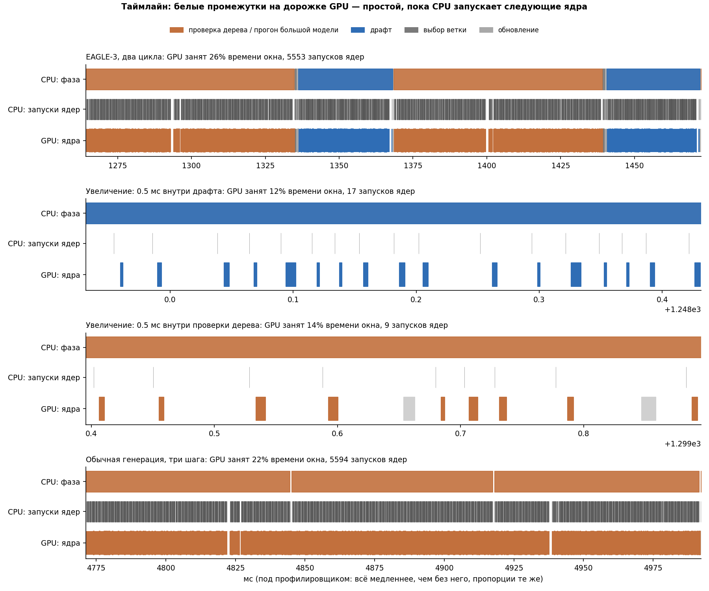
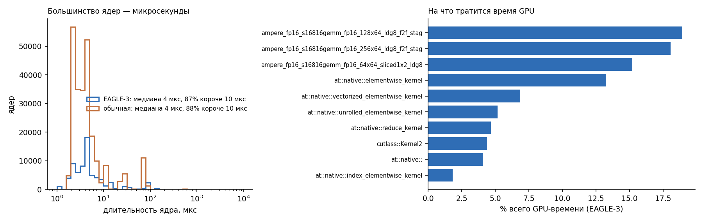
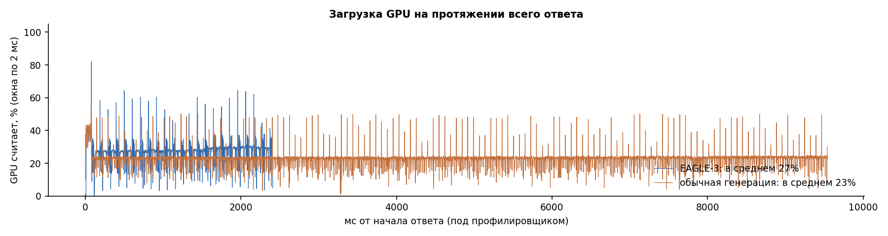

# Код авторов на A100: 3a (T = 0) и профиль

Та же процедура, что на H200: код авторов без изменений (коммит `cb7e084`), официальный драфт, дерево 60 / глубина 8 / top-k 10, fp16, 5 бенчмарков по 80 вопросов.

Машина: NVIDIA A100-SXM4-80GB в Yandex DataSphere. Это виртуальная машина: 28 vCPU AMD EPYC (модель скрыта облаком), torch 2.5.1+cu124. T = 1 не считали: для сравнения со статьёй и проверки гипотезы про железо хватает T = 0, а T = 1 уже посчитан на H200.

## 3a, T = 0

| | статья | A100 | H200 | A100 / статья |
|---|---|---|---|---|
| MT-bench | 4,40× / τ 6,13 | **3,93× / 6,19** | 3,29× / 6,18 | 89 % |
| HumanEval | 4,85× / 6,74 | **4,34× / 6,75** | 3,74× / 6,74 | 89 % |
| GSM8K | 4,48× / 6,23 | **4,06× / 6,28** | 3,46× / 6,26 | 91 % |
| Alpaca | 4,82× / 6,70 | **4,26× / 6,73** | 3,68× / 6,70 | 88 % |
| CNN/DM | 3,65× / 5,34 | **3,51× / 5,39** | 2,75× / 5,39 | 96 % |
| **среднее** | **4,44× / 6,23** | **4,02× / 6,27** | **3,38× / 6,25** | **91 %** |

Цикл EAGLE (τ / ускорение): статья 1,40, A100 1,56, H200 1,85 обычного шага.

## Профиль (MT-bench, первые ходы 5 вопросов)

`profile_eagle.py` и `plot_profile.py`, как на H200. На этих 5 вопросах ускорение 4,29× при τ 6,32: EAGLE даёт 105,6 ток/с, обычная генерация 24,6 ток/с.

| | A100 | H200 |
|---|---|---|
| Обычный шаг, реальное время | **40,6 мс** | 12,7 мс |
| — из них GPU считает (сумма ядер) | 16,4 мс (40 %) | 8,2 мс (65 %) |
| Нижняя граница: прочитать 16 ГБ весов | 7,9 мс (2,04 ТБ/с) | 3,4 мс (4,8 ТБ/с) |
| Запусков ядер за обычный шаг | 1 855 | 1 766 |
| **Реальное время на один запуск** | **~22 мкс** | ~7 мкс |
| Цикл EAGLE, реальное время | 59,8 мс (проверка 39,0 + драфт 17,9 + прочее 2,9) | 21,3 мс |

GPU-работа по фазам цикла (под профилировщиком; на длительность ядер он почти не влияет):

| фаза | A100: GPU, мс | A100: запусков | H200: GPU, мс | H200: запусков |
|---|---|---|---|---|
| обычный шаг | 16,37 | 1 855 | 8,2 | 1 766 |
| проверка дерева (60 токенов) | 18,73 | 1 853 | 9,7 | 1 758 |
| драфт (8 шагов) | 7,42 | 900 | 3,6 | 885 |
| выбор ветки + обновление | 0,21 | 20 | 0,1 | 20 |
| **цикл / обычный шаг** | **1,61** | **1,49** | **1,64** | **1,51** |
| **реальное время: цикл / шаг** | **1,47** | | **1,67** | |

## Что это значит

- **По работе GPU цикл одинаково дорогой на обеих картах: ~1,6 обычного шага.** На A100 все ядра, включая мелкие ядра драфта, медленнее примерно в 2 раза: это примерно разница в памяти (2,04 против 4,8 ТБ/с). Наша прошлая модель («мелкие ядра драфта не ускоряются на быстром GPU, поэтому на A100 цикл будет ≈ 1,40») **не подтвердилась**.
- **Разница — в том, что ограничивает шаг.**
  - **H200 с быстрым CPU** (EPYC 9555): GPU занят ~65 % шага, время задаёт работа GPU. Цикл ≈ 1,64–1,67 шага.
  - **A100 в виртуалке DataSphere:** CPU запускает ядро ~22 мкс, втрое медленнее. GPU занят 40 % шага, и время задаёт число запусков. В цикле их всего в 1,49 раза больше, чем в обычном шаге: драфт запускает 900 ядер, проверка — столько же, сколько обычный шаг. Отсюда цикл 1,47 шага и ускорение 4,0–4,3×.
- **Вывод.** Ускорение EAGLE в коде авторов — не константа метода. Это отношение к обычной генерации на той же машине: чем она медленнее, тем больше ускорение. На «медленной» машине код авторов даёт ~91 % цифры статьи. В абсолютной скорости H200 всё равно быстрее в 2,8 раза: ~293 против 106 ток/с с EAGLE.
- **Что не объяснено.** У авторов цикл ≈ 1,40, это дешевле обоих наших режимов. Остаток ~10 % (4,02× против 4,44×) может давать другая машина, версии torch/transformers или иной замер. Данных, чтобы различить эти причины, у нас нет.

## Картинки профиля A100

- Внутри драфта и проверки GPU занят 12–14 % окна: ядра по несколько микросекунд, между ними десятки микросекунд ожидания запуска.

- За весь ответ GPU занят в среднем 27 % у EAGLE и 23 % у обычной генерации.
