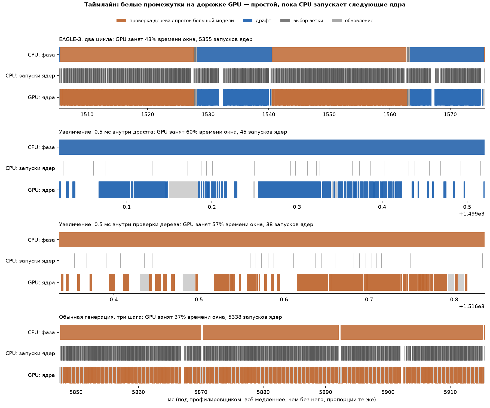
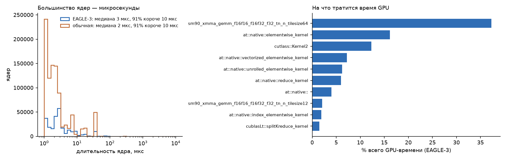
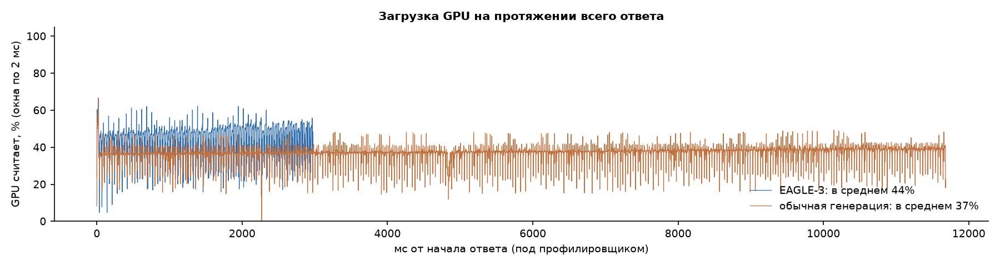

# Задача 3a: куда уходит время цикла EAGLE-3 (код авторов, H200)

`code/inference_speed/profile_eagle.py`: код авторов без изменений, MT-bench, первые 5 вопросов (первый ход), дерево 60 / глубина 8 / top-k 10, T = 0, fp16. Фазы замерены между синхронизациями CUDA. GPU-время — сумма длительностей CUDA-ядер по `torch.profiler`.

| | Время, мс | Запусков ядер | Из них GPU считает |
|---|---|---|---|
| **Шаг обычной генерации** | 12,9 (прогон таргета 12,8 + цикл 0,1) | 1 819 | 8,4 мс (~65 %) |
| **Цикл EAGLE** | 21,5 | 2 967 | 15,6 мс (~73 %) |
| — проверка дерева таргетом (`tree_decoding`) | 13,6 | | |
| — драфт, 8 шагов дерева (`topK_genrate`) | 6,9 | | |
| — выбор ветки (`evaluate_posterior`) | 0,13 | | |
| — обновление без драфта | 0,22 | | |
| — остальной Python цикла | 0,13 | | |
| — prefill (на цикл) | 0,52 | | |

Нижняя граница шага по памяти: веса таргета ~16 ГБ при 4,8 ТБ/с — ~3,3 мс.

**Выводы.**
- **Проверка дерева из 60 токенов стоит почти как один обычный шаг** (13,6 против 12,9 мс).
- **Лишнее время цикла — драфт:** 6,9 мс ≈ 0,54 обычного шага. Драфт из одного слоя делает 8 последовательных шагов из сотен мелких ядер, и время уходит на их запуск с CPU.
- **Обе генерации ограничены запуском ядер, а не GPU.**
  - Обычный шаг — 1 819 запусков ядер (HF-код без слияния операций).
  - GPU считает ~8 мс из 12,9 мс шага.
  - Отношение числа запусков (2 967 / 1 819 = 1,63) почти равно отношению времени (21,5 / 12,9 = 1,67).
- **Отсюда цикл ~1,7–1,85 обычного шага против ~1,4 у авторов.** На их машине (GPU в статье не указан) обычный шаг относительно дороже, а накладные расходы драфта — дешевле. τ при этом совпадает со статьёй.
- **Лечится CUDA graphs / torch.compile** (так работает SGLang) — это задача 3b.

Под профилировщиком время шага растёт (34,8 и 22,1 мс): профилировщик нагружает CPU. Поэтому доли загрузки GPU выше посчитаны по времени без профилировщика.

## В картинках (второй прогон, с метками фаз)

Повтор дал те же числа: цикл 21,3 мс (драфт 6,8 + проверка 13,6), обычный шаг 12,7 мс, цикл = 1,67 шага.
На этих 5 вопросах ускорение 3,75× при τ 6,27.

- **Таймлайн.** Цикл EAGLE (проверка — оранжевым, драфт — синим) и три обычных шага; в двух средних рядах — увеличенные окна по 0,5 мс.
  - Белые промежутки на дорожке GPU — простой, пока CPU запускает следующее ядро.
  - Внутри драфта GPU считает ~60 % окна, внутри проверки ~57 %.
  - Под профилировщиком всё медленнее (он сам нагружает CPU). Без него GPU занят ~65–73 %, но картина та же.

- **Ядра.** 91 % запусков короче 10 мкс, медиана 2–3 мкс. По суммарному времени GPU лидируют GEMM-ядра, остальное — мелкие поэлементные операции.

- **Загрузка во времени.** EAGLE отвечает за ~3 с, обычная генерация — за ~12 с. У обоих GPU занят ровно и мало по всему ответу.

## Итог: почему ускорение ниже, чем в статье (уточнено по фазам)

GPU-работа по фазам — сумма длительностей ядер, запущенных из фазы (`plot_profile.py`, `phases.md`). Профилировщик её не искажает.
CPU сервера: AMD EPYC 9555 (Zen 5, до 4,4 ГГц) — быстрый.

| | GPU-работа, мс | Ядер | Общее время без профилировщика, мс |
|---|---|---|---|
| Обычный шаг | 8,2 | 1 766 | 12,7 |
| **Цикл EAGLE** | **13,4** | 2 663 | **21,3** |
| — проверка дерева (60 токенов) | 9,7 | 1 758 | 13,6 |
| — драфт (8 шагов) | 3,6 | 885 | 6,8 |
| — выбор ветки и обновление | 0,1 | 20 | 0,4 |

- **Цикл дороже обычного шага в 1,64× уже по чистой работе GPU**, и почти так же по общему времени (1,67×). Запуск ядер с CPU добавляет примерно одинаковую долю к обоим, поэтому отношение он не меняет. CPU быстрый и причиной не является.
- **Драфт и проверка — сотни микроскопических ядер, их время почти не зависит от скорости GPU.** У драфта 885 ядер по ~4 мкс: это задержки самих ядер, а не работа с памятью.
- **Обычный шаг на H200 очень быстрый:** веса 8B (16 ГБ) читаются из памяти H200 (4,8 ТБ/с) за 3,3 мс. Чем быстрее память GPU, тем дешевле обычный шаг, а постоянная цена драфта остаётся — доля цикла растёт.
- **Модель на тех же замерах:** заменяем только время чтения весов, остальное оставляем.

| GPU | Чтение весов | Обычный шаг | Цикл | Цикл / шаг | Ускорение при τ 6,25 |
|---|---|---|---|---|---|
| H200 (замер) | 3,3 мс | 8,2 | 13,4 | 1,64 | — |
| H100 (оценка) | 4,8 мс | 9,6 | 14,9 | ~1,55 | ~4,0× |
| A100 (оценка) | 8,0 мс | 12,9 | 18,1 | ~1,40 | ~4,5× |

У авторов цикл ≈ 1,40 шага и ускорение 4,44× — ровно то, что модель даёт для GPU с памятью уровня A100. GPU для Table 1 в статье не указан, поэтому это сильный косвенный довод, а не доказательство. Прямая проверка — замер на A100.

## Обновление: замер на A100 эту модель не подтвердил

Подробно — в [a100.md](a100.md).
- **На A100 все ядра медленнее примерно в 2 раза, включая мелкие ядра драфта** (драфт 7,4 против 3,6 мс GPU-работы). Поэтому по работе GPU цикл там стоит те же ~1,6 обычного шага, а не 1,40, как предсказывала модель выше.
- **Ускорение на A100 всё же выше: 4,02× в 3a.** Причина не в GPU, а в том, что ограничивает шаг:
  - в виртуалке DataSphere CPU запускает ядро ~22 мкс (здесь ~7 мкс), и время шага задаёт число запусков;
  - в цикле запусков всего в ~1,5 раза больше, чем в обычном шаге, отсюда цикл 1,47 шага.
- **Значит, тезис «CPU не причина» верен для H200, но не в общем случае.** На машине с медленным запуском ядер обычная генерация в коде авторов медленнее, и относительное ускорение EAGLE больше.

